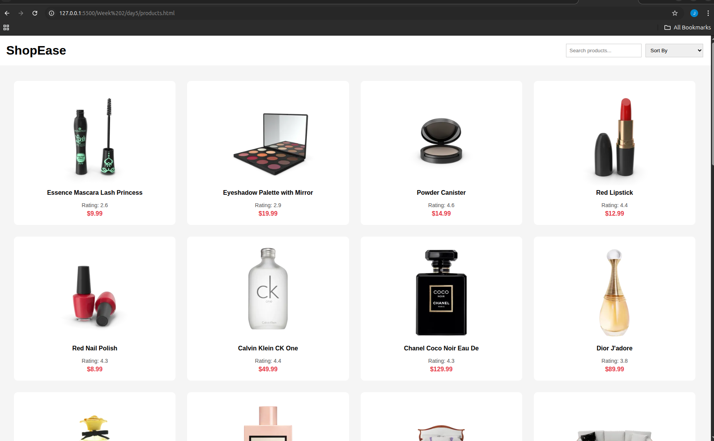
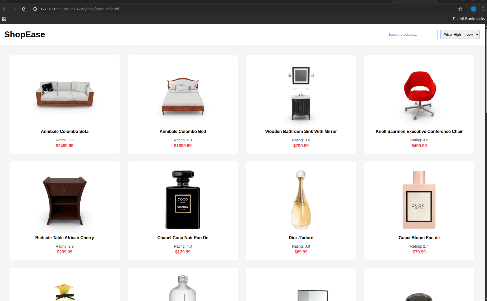
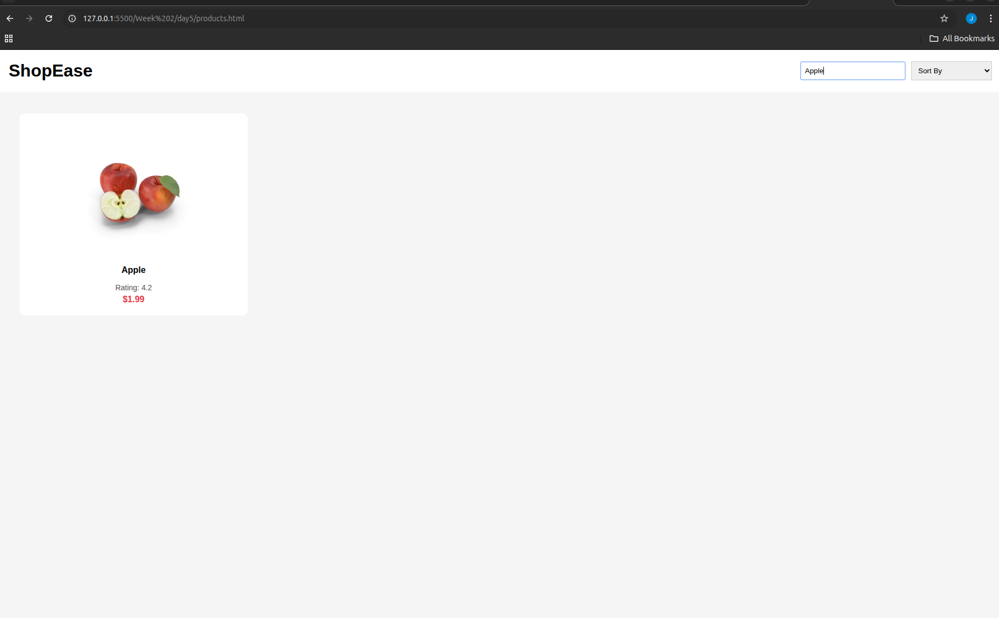

# Week 2 Frontend Capstone

## Project: E-commerce Product Listing Page

### Features:
- Fetch API integration
- Dynamic product rendering
- Search filter
- Sort by price (High → Low)
- Responsive grid layout

### What I Learned:
- Using fetch API with async/await
- DOM manipulation
- Filtering & sorting arrays
- Responsive layout with CSS Grid
- Structuring a frontend project

### Screenshots:
1) Products -

2) Products sorted by High to Low Price filter -

3) Search Product

