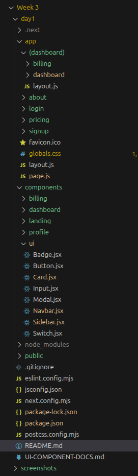
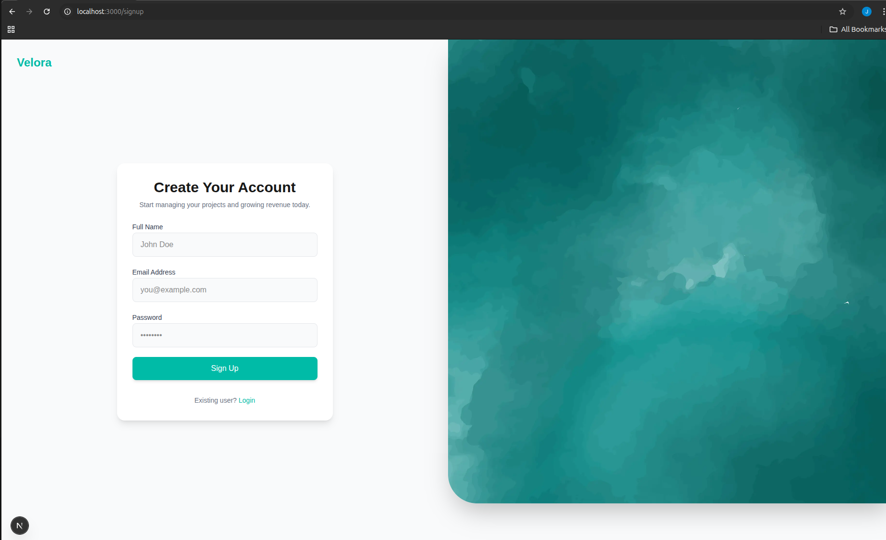
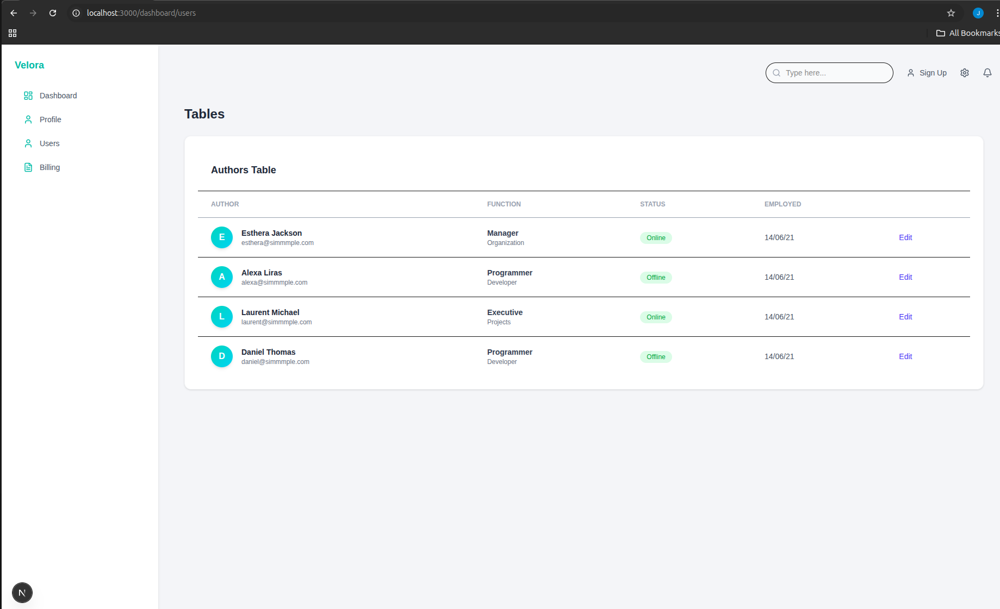
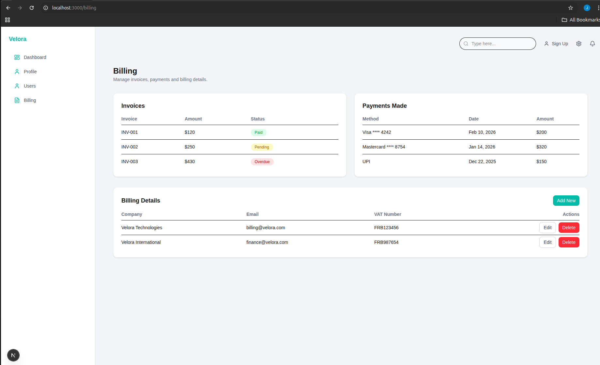

# Week 3 – Advanced Frontend (Next.js + TailwindCSS)

## Project Overview

This project was built as part of **Week 3 – Advanced Frontend Training**.  
The goal was to build a modern, production-grade multi-page frontend application using:

- Next.js (App Router)
- TailwindCSS
- Reusable Component Architecture
- Responsive Design System

This project includes a SaaS-style landing page, authentication pages, and a multi-page dashboard with nested layouts — all built without a backend.

---

# Tech Stack

- Next.js (App Router)
- TailwindCSS

---

# Screenshots

## Folder Structure

## Landing Page

## Signup Page

## Pricing Page

## Dashboard

## Users

## Profile Page

## Billing page

---

# Components List

## Reusable UI Components (`/components/ui`)

These are the core reusable components built using TailwindCSS and props-based design:

- Button.jsx
- Input.jsx
- Card.jsx
- Modal.jsx
- Switch.jsx

These components follow a reusable design system mindset and are used across multiple pages.

---

## Modular Page Components

Other folders inside `/components` like:

- dashboard/
- billing/
- landing/
- profile/

These are not reusable UI components.  
They are used to split large pages into smaller modules so that:

- Code stays clean and readable
- Pages are not too long
- Structure remains scalable

This follows a component composition mindset:
Atoms → Sections → Pages

---

# Pages Implemented

- `/` – Landing Page
- `/about`
- `/pricing`
- `/login`
- `/signup`
- `/dashboard`
- `/dashboard/profile`
- `/dashboard/users`
- `/billing`

---

# Lessons Learned

## 1. Next.js Fundamentals

This week helped me understand:

- File-based routing
- App directory structure (Next.js 15+)
- Layouts & nested layouts
- Page navigation using Link and useRouter
- Difference between Server Components and Client Components ("use client")
- Image optimization using `next/image`
- Font optimization using `next/font`
- Metadata configuration for SEO

I learned how Next.js structures real-world applications using layouts and routing in a clean and scalable way.

---

## 2. TailwindCSS & Design System Thinking

Instead of writing traditional CSS, I learned:

- Utility-first styling
- Responsive breakpoints (sm, md, lg, xl)
- Flexbox and Grid using Tailwind
- Spacing systems (p-x, m-x, gap-x)
- Typography scaling
- Custom theme configuration in `tailwind.config.js`

This helped me build consistent UI quickly without writing custom CSS files.

---

## 3. Component Architecture & UI Thinking

One of the biggest lessons was thinking in components:

- Building reusable UI elements
- Passing props for flexibility
- Designing a small UI library in `/components/ui`
- Separating reusable components from page-level modules

This improved code reusability and maintainability.

---

## 4. Multi-Page Frontend Architecture

Through the exercises, I learned:

- How to structure `/app` and `/components`
- How to create shared layouts
- How nested routing works
- How to build a multi-page frontend without backend

This felt closer to how real SaaS dashboards are structured.

---

## 5. Production Mindset

By the end of Week 3, I understood:

- How to build a full UI system from scratch
- How to replicate a SaaS landing page
- How to optimize images and improve performance
- How to structure a scalable frontend project

---

# Final Outcome

A complete multi-page frontend application built with:

- Clean folder architecture
- Reusable component system
- Responsive UI
- Optimized images
- Structured routing with Next.js App Router

This project represents my understanding of advanced frontend development using Next.js and TailwindCSS.

