# SECURITY REPORT

**Base URL**: http://localhost:5000/api
**Environment**: Development
**Security Middleware Implemented**:
  - Joi Schema Validation
  - Payload Whitelisting (stripUnknown)
  - Rate Limiting (express-rate-limit)
  - Helmet (secure headers)
  - CORS Policy
  - Parameter Pollution Protection (hpp)
  - NoSQL Injection Sanitization
  - Payload Size Limiting

---

1. Schema-Level Validation (Joi)

Test 1: Invalid Query Parameter
Request: GET /api/products?page=-5
Expected Result
Status: 400
Code: VALIDATION_ERROR
Invalid query values are rejected before reaching business logic.
Screenshot:
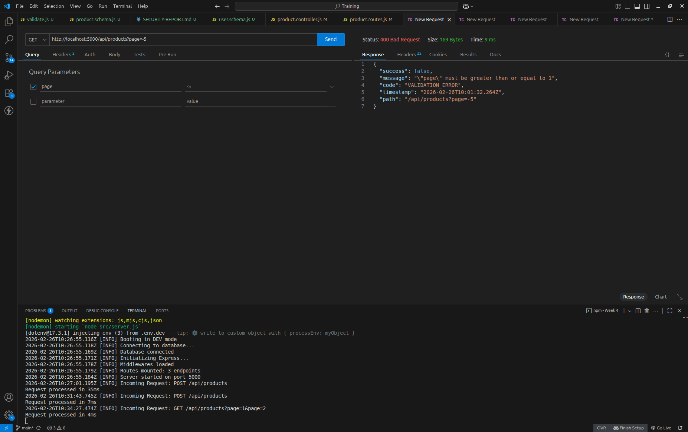

Test 2: Invalid Sort Format
GET /api/products?sort=price:hack
Expected: 400 VALIDATION_ERROR
Regex validation prevents invalid sort injection.
Screenshot:
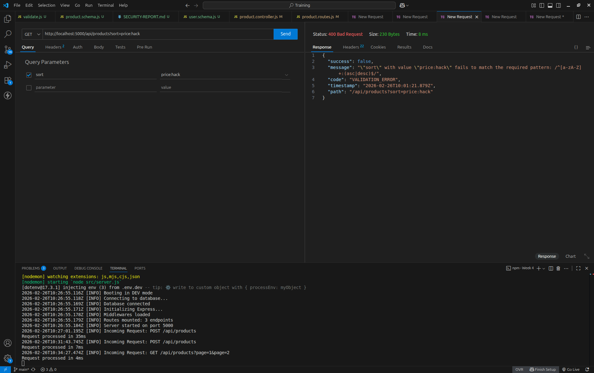

Test 3: Invalid MongoDB ID
DELETE /api/products/123
Expected: 400 INVALID_ID
ObjectId validation prevents malformed ID attacks.
Screenshot:
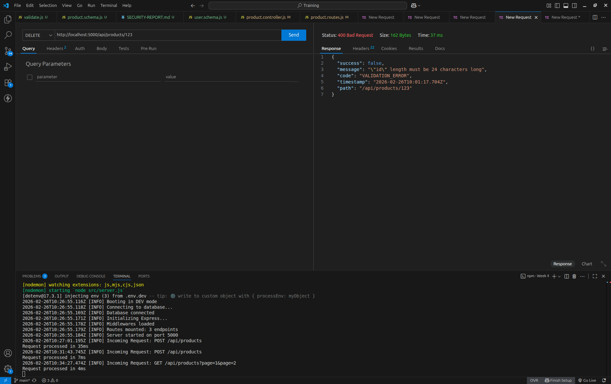

2. Payload Whitelisting

Request

POST /api/products
body: 
{
  "name": "iPhone",
  "price": 1000,
  "isAdmin": true
}

Expected Behavior:
Product created
isAdmin field removed automatically
Unknown fields stripped using:
stripUnknown: true

Screenshot: DB record without isAdmin
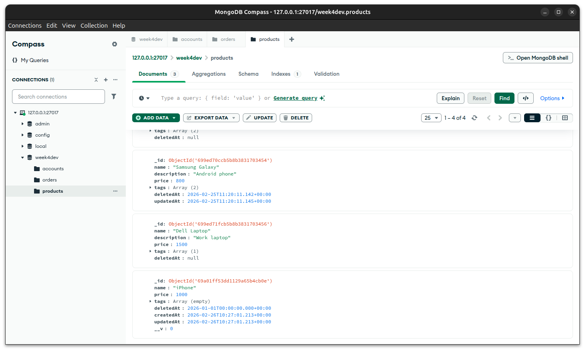

3. NoSQL Injection Protection

Request

{
  "name": { "$gt": "" },
  "price": 100
}

Expected:
Validation failure
Injection does not execute
Operators like $gt are sanitized and blocked.

Screenshot:
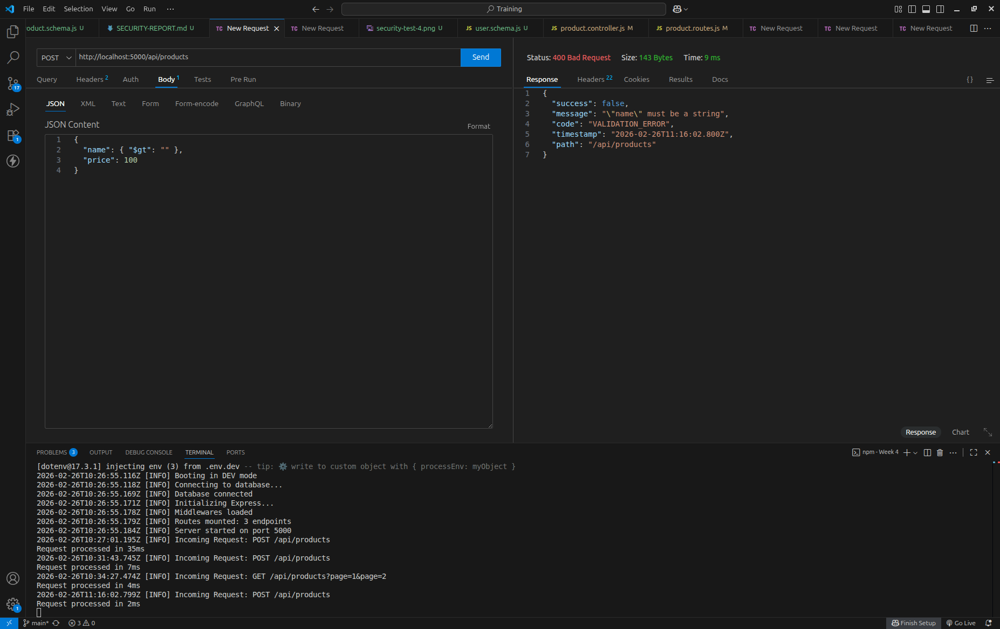

4. XSS Protection

Request

{
  "name": "",
  "price": 200
}

Expected:
Script tags removed or rejected
Stored value does not contain executable script.

Screenshot:
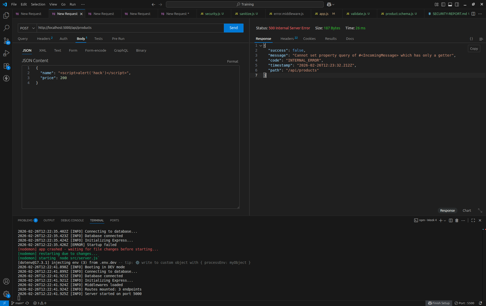

5. Parameter Pollution Protection

Request

GET /api/products?page=1&page=2

Expected:
Request rejected (strict validation) 
No crash
Duplicate query parameters are rejected with 400 validation error.
System does not allow ambiguous input.
Screenshot:
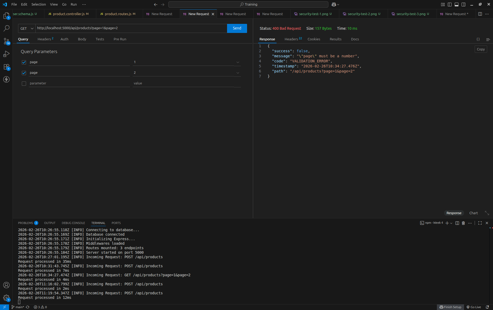

6. Rate Limiting

Test Command
for i in {1..120}; do curl http://localhost:5000/api/products; done

Expected:
Status: 429
Code: RATE_LIMIT_EXCEEDED
After 100 requests within 15 minutes, further requests are blocked.

Screenshot:
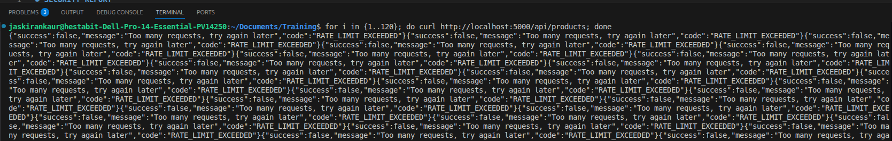

7. Payload Size Limiting

Test:
Send JSON body larger than 10KB.
Expected:
413 Payload Too Large
Large payloads are rejected using:
express.json({ limit: "10kb" })

Screenshot:
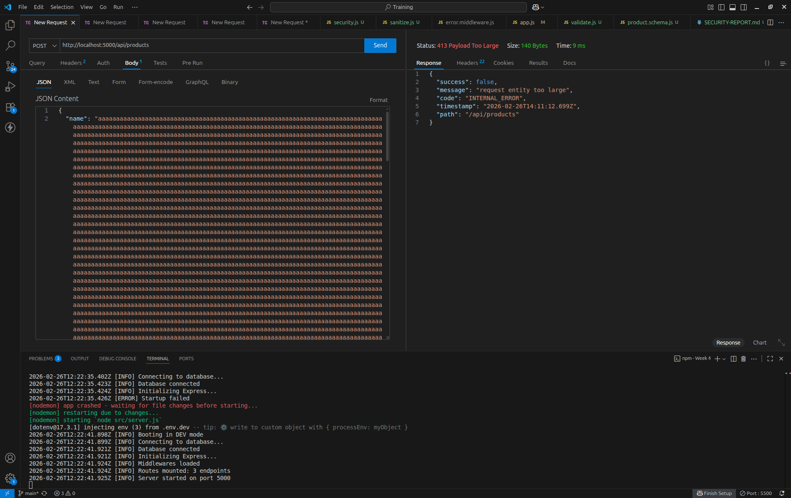

8. Helmet Header Hardening

Checked Response Headers in Browser DevTools.
Headers Present:
X-Content-Type-Options: nosniff
X-Frame-Options: SAMEORIGIN
Content-Security-Policy
Security headers successfully applied.

Screenshot: Network -> Response Headers
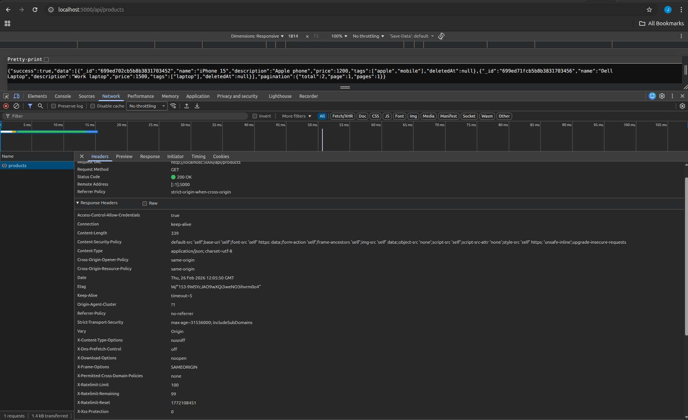

9. CORS Policy Enforcement

Tested API call from unauthorized origin.
Expected:
Blocked by browser.
CORS restricts requests to allowed origins only.

Screenshot:
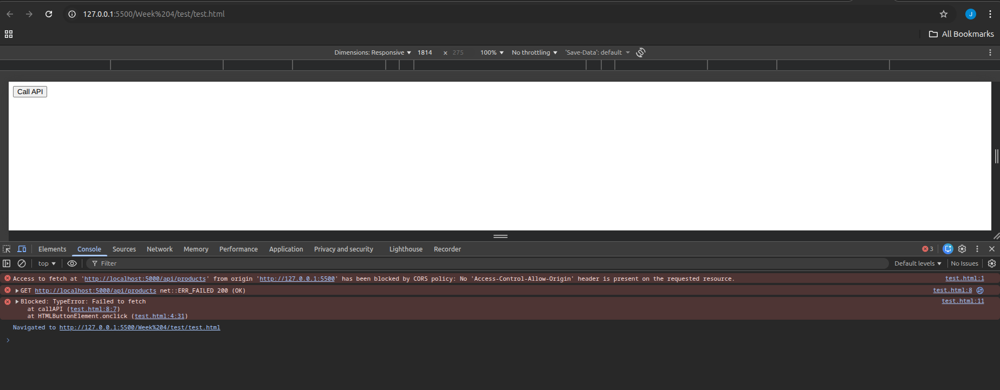